# WelcomeWithAzureAD
Authentication Azure Active Directory

## Prerequisites
* node.js installed: https://nodejs.org/en/download/
* angular cli is installed: https://angular.io/guide/setup-local#install-the-angular-cli
* azure account: https://azure.microsoft.com/en-us/free/
* .net SDK installed: https://dotnet.microsoft.com/en-us/learn/dotnet/hello-world-tutorial/install

## Initiate the app
* Create the angular app with `ng new welkome-microsoft-identity`. 
    * Optional you can choose to add angular routing 
        ```
            ? Would you like to add Angular routing? Yes
        ```
    * Optional you can choose SCSS for styling
        ```
            ? Which stylesheet format would you like to use? SCSS 
        ```
* Switch to the app folder `cd welkome-microsoft-identity`
* Test that your app is running with `ng server -o`
* Instal MSAL Browser and MSAL Angular `npm install @azure/msal-browser @azure/msal-angular`. 
    * [Microsoft Authentication Library (MSAL)](https://docs.microsoft.com/en-us/azure/active-directory/develop/msal-overview) is a library that developers can use to interact with the Microsoft identity platform. 
    * The [Microsoft identity platform](https://docs.microsoft.com/en-us/azure/active-directory/develop/v2-overview) is a servive that enables developers to allow users access using theyr Microsoft account. Login using social accounts is also supported.

* Optional: install angular material `ng add @angular/material`


## Register the app to Azure

* Sign in to the Azure portal. https://portal.azure.com
    
* Search for and select Azure Active Directory. https://portal.azure.com/#blade/Microsoft_AAD_IAM/ActiveDirectoryMenuBlade/Overview

* Under Manage, select App registrations > New registration.
    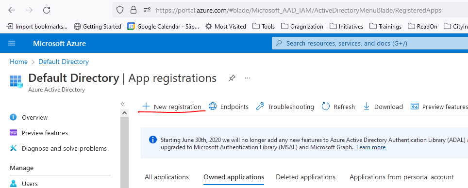

* Enter a Name if the application `WelkomeAzureAD`. Users of your app might see this name, and you can change it later.
* Under Supported account types, select `Accounts in any organizational directory (Any Azure AD directory - Multitenant) and personal Microsoft accounts (e.g. Skype, Xbox)`.

* Select Register. More details about the registration options here: https://docs.microsoft.com/en-us/azure/active-directory/develop/quickstart-register-app#register-an-application 

    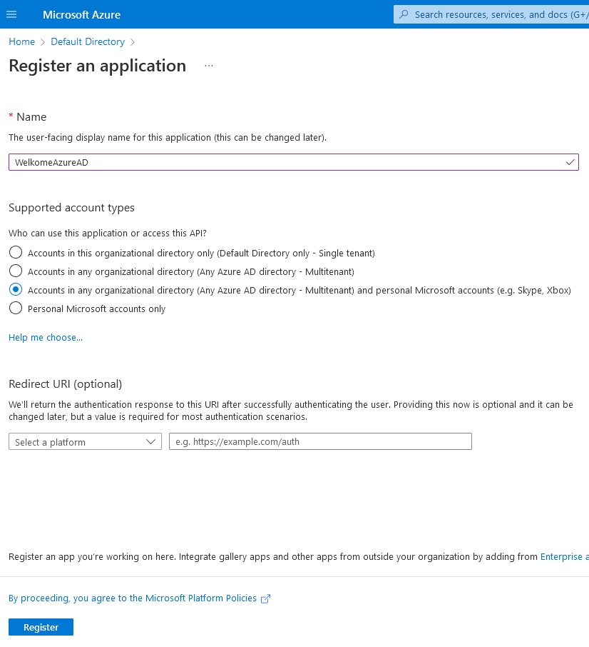

* You will be able to see the list of registered apps in Azure under your Directory. https://portal.azure.com/#blade/Microsoft_AAD_IAM/ActiveDirectoryMenuBlade/RegisteredApps . For each registered app you have a unique `Application (client) ID`.

    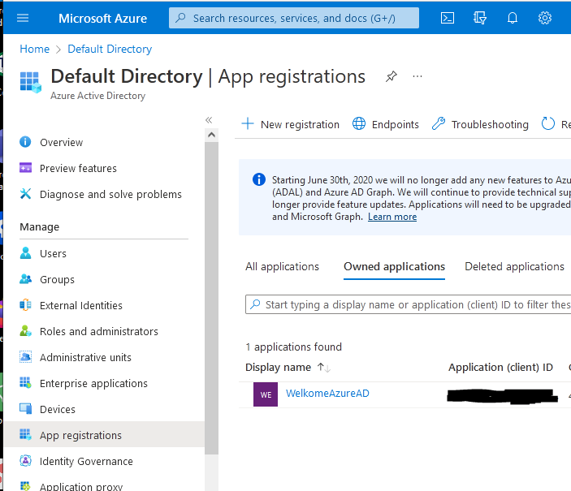

## Configure the Redirect URI for the registered app.

* In the list of registered apps in Azure under your Directory select the app you just created `WelkomeAzureAD`

* Click on the `Authentication` sub menu. Then click on the `Add a platform` link.

    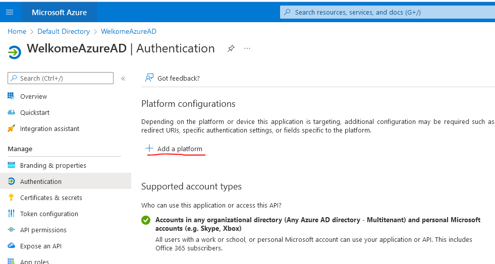

* Select `Single-page application` on the `Configure platforms` section that is now shown. This action will open the `Configure single-page application` section.

* In the `Configure single-page application` section set the `Redirect URIs` to `http://localhost:4200/`

* Click on the `Configure` button to finish configuration

    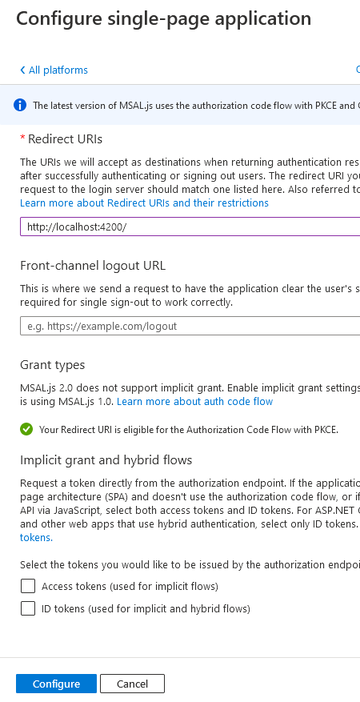

## Update the code to use the app registration

* Create a new configuration service using `ng generate service src/app/services/weather`.

* In the `auth-config.service.ts` add a `MSALInstanceFactory` function.

    ```Typescript
    export function MSALInstanceFactory(): IPublicClientApplication {
    return new PublicClientApplication({
        auth: {
            clientId: '00000000-0000-0000-0000-000000000000',
            authority: 'https://login.microsoftonline.com/common',
            redirectUri: 'http://localhost:4200/'
        },
        cache: {
            cacheLocation: BrowserCacheLocation.LocalStorage
        }
    });
    }
    ```

* You can get you client id from the list of registered apps in Azure under your Directory.
* For the authority we used `https://login.microsoftonline.com/common` because we selected the account type `Accounts in any organizational directory (Any Azure AD directory - Multitenant) and personal Microsoft accounts (e.g. Skype, Xbox)` when we registed the app. More on authority here: https://docs.microsoft.com/en-us/azure/active-directory/develop/msal-client-application-configuration#authority

* In the `app.module.ts` add the `MsalModule` to the list of imported modules
    ```Typescript
        @NgModule({
            ...
            imports: [
                BrowserModule,
                AppRoutingModule,
                MsalModule
            ],
            ...
    ```

* Add to the list of providers the `MSALInstanceFactory` `MsalService` and `MsalBroadcastService`

    ```Typescript
        @NgModule({
            ...
            providers: [
                {
                    provide: MSAL_INSTANCE,
                    useFactory: MSALInstanceFactory
                },
                MsalService,
                MsalBroadcastService
            ]
            ...
    ```

* In the component that will hold the login / logut button ( in this example this is done in the `app.component.ts` ) add instances of the `MsalService` and `MsalBroadcastService` as constructor parameters.

    ```Typescript
        constructor(
            private authService: MsalService,
            private msalBroadcastService: MsalBroadcastService
        ) {  }
    ```

* Add a component property `_destroying$`. This will be used in to cancel all subscriptions when we close the component.

    ```Typescript
      private readonly _destroying$ = new Subject<void>();
    ```

* Add a subject `userName` to hold the user name when the user is loged in.

    ```Typescript
      userName: string | undefined = undefined;
    ```

* Setup the `userName` property update logic in the `ngOnInit` of the component. The `userName` property  will be updated every time the MsalBroadcastService instance will trigger a change in the `inProgress$` observable and the InteractionStatus has the value None.

    ```Typescript
        this.msalBroadcastService.inProgress$
        .pipe(
            filter((status: InteractionStatus) => status === InteractionStatus.None),
            takeUntil(this._destroying$)
        )
        .subscribe(() => {
            const accounts = this.authService.instance.getAllAccounts(); 
            this.userName = accounts.length > 0 ? accounts.shift()?.name : "";
        }); 
    ```

* Remember to unsubscrive to the observable when the component is closed.

    ```Typescript
        ngOnDestroy(): void {
            this._destroying$.next(undefined);
            this._destroying$.complete();
        }    
    ```

* Then add the `logIn` and `logOut` function

    ```Typescript
        login() {
            this.authService.loginPopup()
            .subscribe((response: AuthenticationResult) => {
                this.authService.instance.setActiveAccount(response.account);
            });
        }

        logout() {
            this.authService.logoutPopup({
                postLogoutRedirectUri: 'http://localhost:4200'
            }); 
        }
    ```

* Then add the `logIn` and `logOut` buttons in the template.

    ```HTML
        <button mat-raised-button *ngIf="!isLoggedIn" (click)="login()">Login</button>
        <button mat-raised-button *ngIf="isLoggedIn" (click)="logout()">Logout</button>
    ```

* Show the name of the logged in user
    ```HTML
      <span>Welcome {{userName}}</span>
    ```

* When you run the aplication and click the login button the microsoft login popup will appear.

    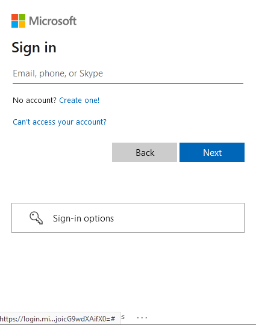

* After you provide your credentials, Microsoft will ask you, in a popup, to allow the application to access your private data.

    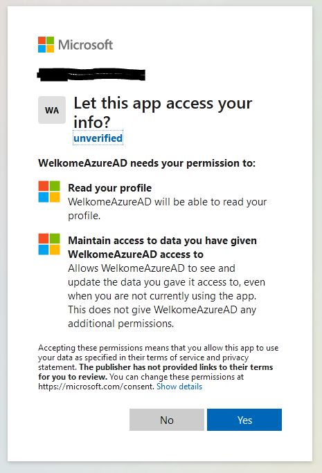

* After the login processes is completed. User information will be stored in the `cacheLocation` indicated in the `MSALInstanceFactory` function. So the browser will know that the user is authenticated and will not ask for credentials again if the user closes the app and returns to it later.

    ```Typescript   
        cache: {
            cacheLocation: BrowserCacheLocation.LocalStorage
        }
    ```
* In a similar way the user information will be removed from cache when the user logs out.

## Create the backend REST API

* Make sure you are not in the welkome-microsoft-identity folder. If you are in the welkome-microsoft-identity you can go one level up with `cd ..`.

* Initiate a new REST API in .net using `dotnet new webapi --auth IndividualB2C -o WelkomeIdentityBackend `

* Go to the newly created folder `cd WelkomeIdentityBackend`

* Test that the app is working by running `dotnet run`. You should see something like this:

    ```
        Building...
        info: Microsoft.Hosting.Lifetime[14]
            Now listening on: https://localhost:7264
        info: Microsoft.Hosting.Lifetime[14]
            Now listening on: http://localhost:5059
        info: Microsoft.Hosting.Lifetime[0]
            Application started. Press Ctrl+C to shut down.
        info: Microsoft.Hosting.Lifetime[0]
            Hosting environment: Development
    ```

* The sample application is automaticaly build with swagger enabled. In your browser go to `http://localhost:7264/swagger/index.html`. The port might be different on your system. Also you might need to accept any potential warning indicating that the application is not signed.

* You can stop the sample application by pressing Ctrl+C in the terminal that is running the .net application.

* In the `Program.cs` file add the cors policy to allow communication between the browser and the REST API.

    ```C#
        builder.Services.AddCors( options => {
            options.AddDefaultPolicy(
                policy => {
                    policy.AllowAnyHeader();
                    policy.AllowAnyMethod();
                    policy.WithOrigins("http://localhost:4200");
                    policy.AllowCredentials();
            });
        });
        ...
        app.UseCors();
    ```

## Register the REST API on the azure portal

* Sign in to the Azure portal. https://portal.azure.com
    
* Search for and select Azure Active Directory. https://portal.azure.com/#blade/Microsoft_AAD_IAM/ActiveDirectoryMenuBlade/Overview

* Under Manage, select App registrations > New registration.

* Enter a Name if the application `WelkomeIdentityBackend`. Users of your app might see this name, and you can change it later.
* Under Supported account types, select `Accounts in any organizational directory (Any Azure AD directory - Multitenant) and personal Microsoft accounts (e.g. Skype, Xbox)`.

* You will be able to see the list of registered apps in Azure under your Directory. https://portal.azure.com/#blade/Microsoft_AAD_IAM/ActiveDirectoryMenuBlade/RegisteredApps .
Click on the name of the backend application `WelkomeIdentityBackend` to show the configuration menu.
    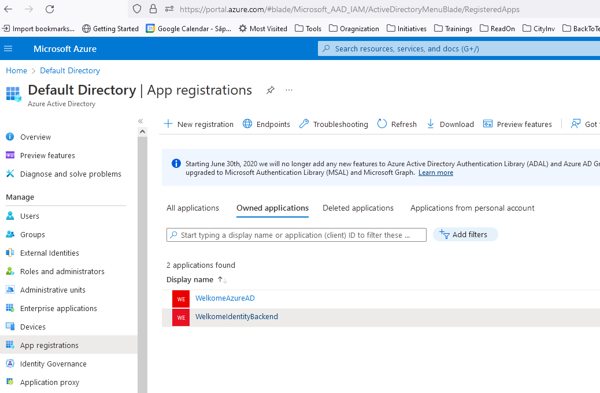

* Select the `Expose API` option from the right side menu.

* Select `Set` next to Application ID URI if you haven't yet configured one. App ID URI acts as the prefix for the scopes you'll reference in your API's code, and it must be globally unique.
    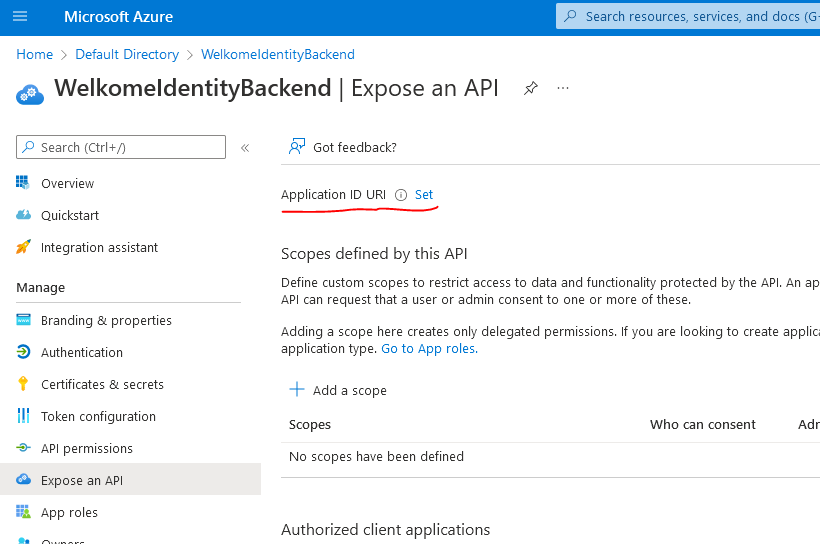

* Then select the `Add a scope` option, and set the scope name `access_as_user`. Before saving remember to set the Enable toggle.

    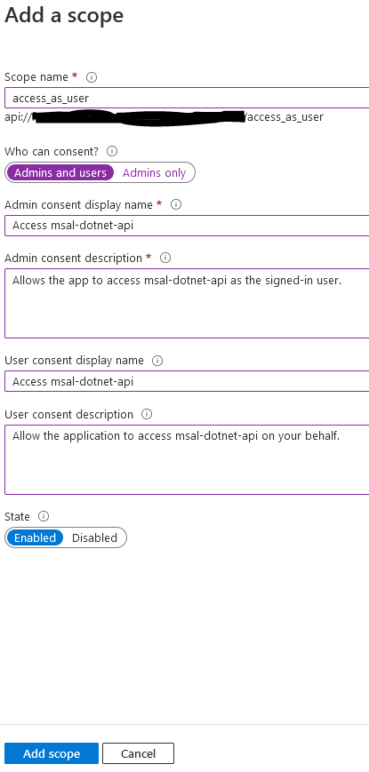

* Optional you can preauthorize the fronent applicaiton so that the users are not promted for consent

## Configure the REST API to use the app registration

* Open the file `WelkomeIdentityBackend/appsettings.json` and add the following section

    ```
        "AzureAd": {
            "Instance": "https://login.microsoftonline.com/",
            "Domain": "Enter the domain of your Azure AD tenant, e.g. 'contoso.onmicrosoft.com'",
            "TenantId": "Enter the tenant ID",
            "ClientId": "Enter the Client ID (aka 'Application ID')"
        },      
    ```

* On the `Domain` property set the name of your tennant. You can find the name of your tennant on the Overview section of the Azure Active Directory.

    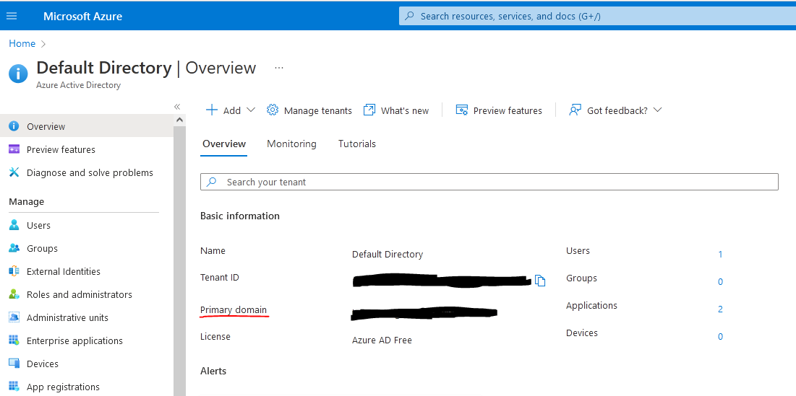

* You can get the values for `TenantId` and `ClientId` by selecting your registered app `WelkomeIdentityBackend` under Azure Active Directory > App registrations

* Open the `WeatherForecastController.cs` file and add proprety `scopeRequiredByApi` with the value of the scope defined in the previous step `access_as_user`:

    ```C#
        public string[] scopeRequiredByAPI = new string[] { "access_as_user" };
    ```

* Protect the `GetWeatherForecast` route by using the `VerifyUserHasAnyAcceptedScope` function.

    ```C#
        [HttpGet(Name = "GetWeatherForecast")]
        public IEnumerable<WeatherForecast> Get()
        {
            HttpContext.VerifyUserHasAnyAcceptedScope(scopeRequiredByAPI);
            ...
    ```

## Configure the frontend app to access the API

* Sign in to the Azure portal. https://portal.azure.com
    
* Search for and select Azure Active Directory. https://portal.azure.com/#blade/Microsoft_AAD_IAM/ActiveDirectoryMenuBlade/Overview

* You will be able to see the list of registered apps in Azure under your Directory. https://portal.azure.com/#blade/Microsoft_AAD_IAM/ActiveDirectoryMenuBlade/RegisteredApps .
Click on the name of the frontend application `WelkomeAzureAD` to show the configuration menu.

* Select the `API permisions` on the right side menu. Then click on `Add a permision`.

    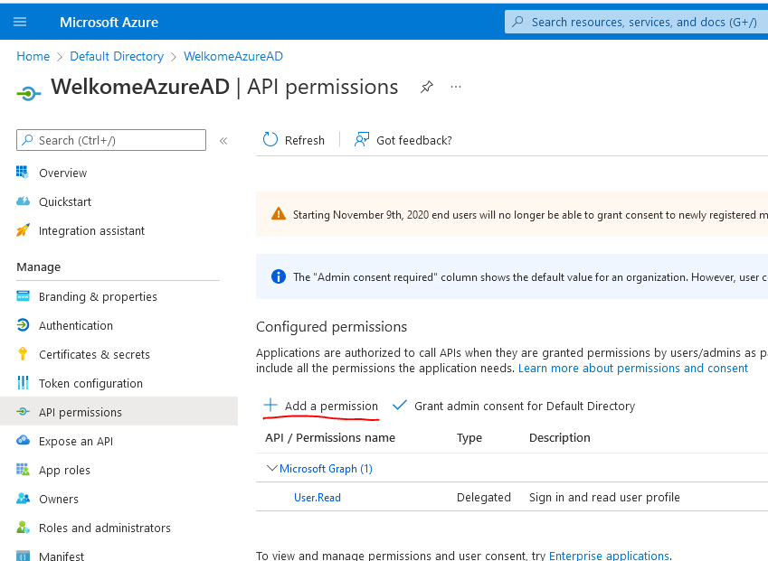

* Select `My APIs` on the right side menu and click on your API (`WelkomeIdentityBackend`)

* Then write the scope `access_as_user` you defined at the previous step.

    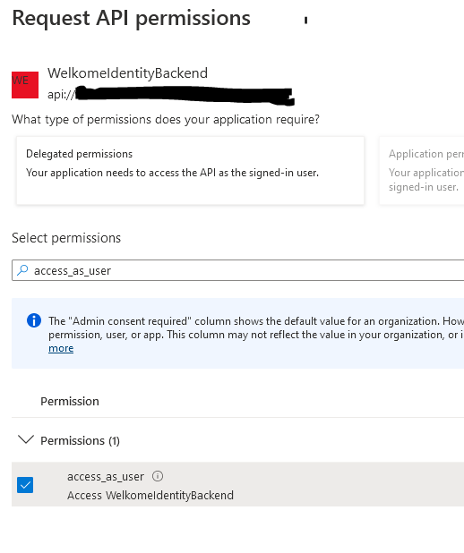

* You should see the selected permissions under Configured permissions.

* In the `auth-config.service.ts` update the auth.authority from the `MSALInstanceFactory` function so it uses your tennant ID instead of `common`.

    ```Typescript
    export function MSALInstanceFactory(): IPublicClientApplication {
        return new PublicClientApplication({
            auth: {
                ...
                authority: 'https://login.microsoftonline.com/000000000-0000-0000-0000-000000000000',
                ...
    ```

## Sent authentication token for request to the backend 

* In the `auth-config.service.ts` we need add the protected url, scope and the `MSALInterceptorConfigFactory`. This interceptor will used to aquaire tokens for outgoing http request to protected client resources. 
    * More in Angular interceptors here: `https://angular.io/api/common/http/HttpInterceptor`

    ```Typescript
        export const protectedResources = {
            weather: 'https://localhost:7264/WeatherForecast'
        };

        export function MSALInterceptorConfigFactory(): MsalInterceptorConfiguration {
            const protectedResourceMap = new Map<string, Array<string>>();
            protectedResourceMap.set(protectedResources.weather, ['api://00000000-0000-0000-0000-000000000000/access_as_user']);

            return {
                interactionType: InteractionType.Redirect,
                protectedResourceMap
            };
        }
    ```

* Aslo in the `app.module.ts` add the `MsalInterceptor` and `MSALInterceptorConfigFactory` to the list of providers

    ```Typescript
        providers: [
                {
                    provide: HTTP_INTERCEPTORS,
                    useClass: MsalInterceptor,
                    multi: true
                },
                {
                    provide: MSAL_INTERCEPTOR_CONFIG,
                    useFactory: MSALInterceptorConfigFactory
                },                
                ....
    ```

* In `app.module.ts` add the `HttpClientModule` to the list of imported modules. This will be needed to make the calls to the backend.

    ```Typescript
        imports: [
            ...
            HttpClientModule 
            ...
        ],
    ```

* Let's create a new service for reading data from the backend.

    ```
        ng generate service services/weather
    ```

* In the `weather.service.ts` add the server url as a property `readonly url: string = protectedResources.weather;`

* Add a `HttpClient` client as a constructor parameter.

    ```Typescript
        constructor(
            private http: HttpClient
        ) { }
    ```

* And a function for making the http request.


    ```Typescript
        public getForecast(): Observable<any[]> {
            return this.http.get<any[]>(this.url);
        }
    ```

* Let's setup the dependecy injector by adding the weather service to the list of providers in `app.module.ts`.

    ```Typescript
        providers: [
            WeatherService             
            ...
    ```

* To use the `WeatherService` in our component (`app.component.ts`) we need to add a `WeatherService` instance as a constructor parameter.
    ```Typescript
        constructor(
            ...
            private weatherService: WeatherService
        ) {  }
    ```

* Let's add a property that will contain the forecast.
    ```Typescript
        forecastCollection: any[] = [];
    ```

* Now let's implement triggering the backend call.
    ```Typescript
        getForecast() {
            this.weatherService.getForecast().subscribe((result) => {
            this.forecastCollection = result.map(data => { return {
                date: new Date(data.date).toUTCString(),
                summary: data.summary,
                temperatureC: data.temperatureC
            }});
            })
        }
    ```

* In the template add a button to call the function we just created and a list to show the forecast. This section will only be shown if the value of userName is valid.

    ```HTML
        <div *ngIf="userName">
            <h2 >Weather forecast</h2>
            <button mat-raised-button (click)="getForecast()">Update Forecast</button>
            <dl>
            <div *ngFor="let forecast of forecastCollection" class="card">
                <dt>
                {{forecast.date}}
                </dt>
                <dd>
                {{forecast.summary}} {{forecast.temperatureC}}°C
                </dd>        
            </div>
            </dl>
        </div>
    ```

* The first time the frontend will try to access the protected backend path, Azure will ask the user to accept that the front end app will access the backend. This could be avoided by preautorizing the front end app. 

    

## TO BE ADDED

* Not present in this example: You could protect cerain application routes by using the `MSAL_GUARD_CONFIG`: https://docs.microsoft.com/en-us/azure/active-directory/develop/tutorial-v2-angular-auth-code#guarding-routes
* Preaprove front end applications: https://docs.microsoft.com/en-us/azure/active-directory/develop/quickstart-configure-app-expose-web-apis#add-a-scope
